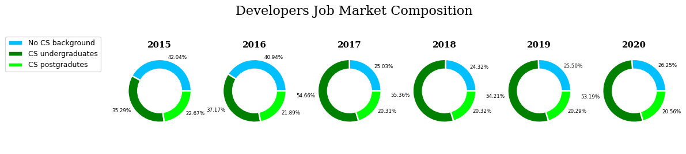
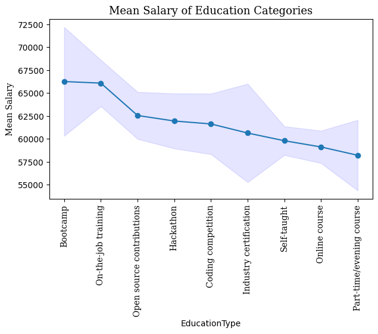

# StackOverflow Analysis

## Installation
This is a notebook that doesn't require running to view, but if you ever wanted to run make sure you use python 3 and have:
* matplotlib
* seaborn
* pandas
* numpy

## Project Motivation
This project is the first project in the Udacity Data Scientist Nanodegree, where we are required to apply the CRISP-DM process to dataset.

I chose the StackOverflow data as I wanted to ask a couple of questions that bothered me personally, and they are:
* How are developers with no CS background represented in the job market? 
* What non degree education (online courses, bootcamps, etc..) do data scientists focus on?
* Is salary the reason of job dissatisfaction or are there other reasons?

## How to use this
The repository contains as jupyter notebook and html for easy viewing. The charts are also available in the imgs directory.

If you want to run the notebook, it will download all the data required for making the analysis into a new folder called downloads/ and then it will unzip each zipped file into a new directory within a new directory called data/.

Of course, I wouldn't recommend running the notebook if you don't have the some space to spare.

## Project Findings

1. I found out that the share of developers with no CS background decreased starting from 2016 due to a increased number of CS undergraduates entering the field.

2. The most salary correlated means aren't online courses and part-time programs, but rather practical and competitive ones such as industry certifications, open source contributions and hackathons.

3. There is no linear relationship between salary and job satisfaction

